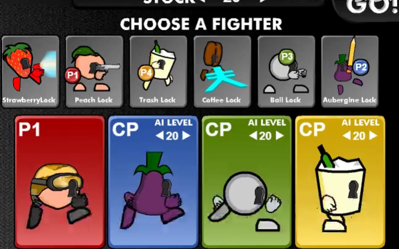

# 未来主要更新：Godot目录
___

其它可能的构建方案：
1：vue+vite+phaser.js 前端项目build后的dist放入maui(razor)的wwwroot路径中使用嵌套webview的方式实现桌面端和移动端应用的构建。

童年经典游戏：疯狂小人战斗魔改版
个人开源兴趣制作，持续更新，欢迎贡献！

 krita艺术创作备份仓库：https://gitee.com/alonai/krita-Crazy-villains-brawl